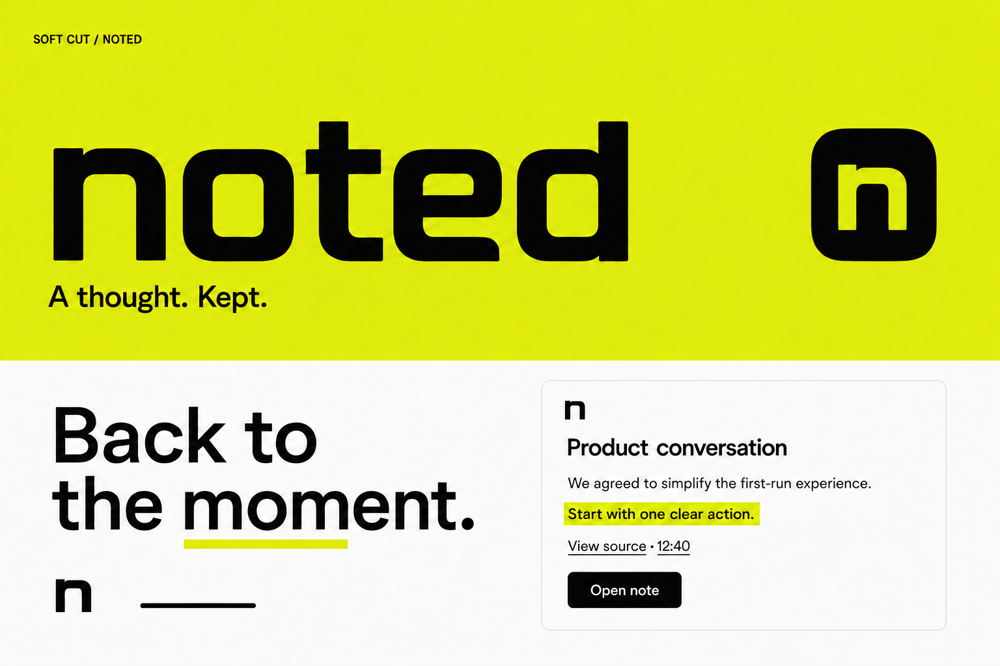

# Noted brand direction

Status: selected visual direction; an interactive product foundation is implemented in `src/design-system/`. The Mac product now integrates the foundation; production vector artwork remains pending.

## Selected reference

The user selected **Soft Cut**, confirmed by the attached image below. This is
the corrected lowercase wordmark, with five separate letters and a compact
matching “n” icon in that exploration. The wordmark remains selected; the final
Aperture artwork now replaces the “n” as the product app icon.

## Design decisions

- Bold, compact, softly squared lowercase **noted** wordmark with open counters.
- Aperture app icon: a white open frame on black with four neon ticks. See
  [the canonical artwork guide](aperture/README.md).
- Neon citron (`#DFFF00`) is the default accent with black and white. Electric
  blue, hot pink, and acid green can replace it through a shared semantic token
  layer. The raster remains a visual reference for the intended energy.
- Expressive brand applications, with a clean, primarily white-and-black product
  interface. Use citron selectively for meaningful emphasis and highlights.
- Preserve the personal character and give the identity enough distinction to
  stand apart from generic productivity software.
- Use this as the default direction while retaining custom themes as
  alternative options.

The sample slogans and meeting-note layout illustrate the direction; they are
not separately approved final copy or a complete interface specification.

## Relationship to existing guidance

This selection replaces the warm off-white and clay palette preference for the
new default design exploration described in `.impeccable.md`. The Mac product uses this foundation through its new built-in neon themes;
existing custom theme implementations remain available. The product strategy in
`PRODUCT_STRATEGY.md` remains authoritative for positioning and capabilities.

## Next design work

The subsequent name and font alternatives were not selected. Retain Noted,
Soft Cut, and Geist for product text. The first design-system preview now covers
notes, capture, and source navigation in four accents and two modes; see
[the design-system guide](../design-system/README.md). The foundation is now integrated into the Mac product with citron as its
default. Next, refine production vector artwork while retaining the selected
wordmark silhouette and existing custom themes.
